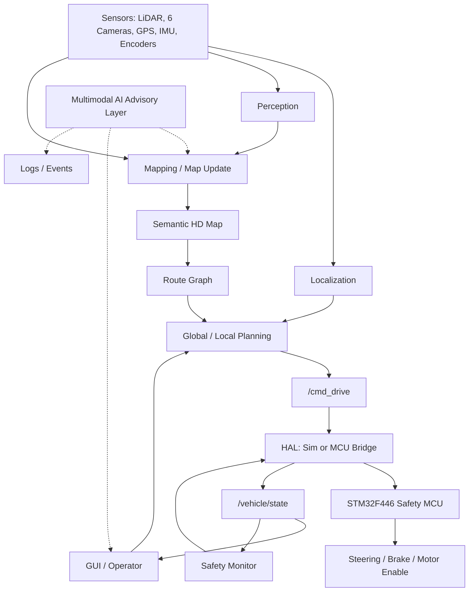

# ARIS AI System Architecture Specification 최종본

원문 기준: `260617 - AI System Architecture Specification v1.0.pdf`

문서 상태: Final architecture baseline  
적용 저장소: `aris-dev-env`  
적용 범위: ARIS 자율주행 연구 플랫폼의 시스템 프레임워크, 통신규약, 내부 구조, workflow, 안전, 검증 기준

## 1. 문서 목적

이 문서는 PDF 설계서를 현재 저장소 기준으로 구현 가능한 아키텍처 계약서 형태로 정리한 최종본이다. 단순 기능 설명이 아니라 다음 질문에 답하는 것을 목표로 한다.

- 어떤 하드웨어와 소프트웨어가 시스템 경계를 이루는가.
- 어떤 ROS2 topic, MCU frame, 상태, fault가 계약으로 고정되는가.
- 센서, localization, mapping, planning, control, GUI, AI layer가 어떤 책임을 갖는가.
- 정상 workflow와 failure workflow가 어떤 순서로 진행되는가.
- V0부터 V6까지 무엇을 완료로 인정할 수 있는가.

## 2. 시스템 목표

ARIS는 약 500 m x 500 m의 사전 매핑된 실외 ODD 안에서 목적지를 입력하면 스스로 경로를 탐색하고 이동하는 Level 4 지향 자율주행 연구 플랫폼이다.

최종 목표는 waypoint replay가 아니라 다음 구조이다.

```text
Mapping
 -> Semantic HD Map
 -> Route Graph
 -> Localization
 -> Goal Based Planning
 -> Autonomous Driving
 -> Repeated Map Update
```

핵심 특성:

- 목적지 기반 이동.
- 지도 기반 경로 탐색.
- 반복 주행을 통한 map confidence 개선.
- semantic layer 보유.
- 동적 장애물 회피.
- AI 기반 semantic review와 log analysis.
- Safety MCU 기반 actuation safety.

## 3. 비목표

다음은 명시적 비목표이다.

- AI model이 steering, throttle, brake를 직접 명령하지 않는다.
- Planner가 serial/CAN frame을 직접 만들지 않는다.
- 시뮬레이터 전용 조건을 planning algorithm 안에 넣지 않는다.
- V1 teach-and-repeat를 최종 navigation 구조로 간주하지 않는다.
- `ARIS_ENABLE_REAL_ACTUATION=1` 없이 실제 구동계를 움직이지 않는다.

## 4. ODD

| 항목 | 기준 |
|---|---|
| 운영 환경 | 실외, 통제 또는 준통제 환경 |
| 운영 면적 | 약 500 m x 500 m |
| 예시 | 학교 캠퍼스, 연구단지, 공원, 폐쇄형 테스트 환경 |
| 기본 자율주행 속도 | 15 km/h class |
| 제한 최고 속도 | 25 km/h class |
| 비기본 상한 참고값 | 45 km/h, 별도 안전 심사 필요 |

최종 현장 운영 전 추가로 수치화해야 할 ODD 항목:

- 날씨: 비, 안개, 눈, 강풍 허용 여부.
- 조도: 야간/역광/저조도 허용 여부.
- 노면: 경사, 턱, 자갈, 젖은 노면, 잔디 통과 조건.
- 보행자/자전거 밀도.
- GPS 음영 구역 허용 시간.
- LiDAR 또는 camera dropout 허용 시간.
- 통신 지연과 packet loss 한계.

## 5. 전체 시스템 프레임워크



## 6. 하드웨어 구조

| 구성 | 하드웨어 | 책임 |
|---|---|---|
| Main Computer | DGX Spark | SLAM, localization, planning, perception, GUI, map update, AI tooling |
| Auxiliary Compute | KR260 | 보조 I/O 또는 실시간 보조 처리 후보 |
| Safety MCU | STM32F446 | steering control, brake control, motor enable, watchdog, E-stop, fault handling |
| Primary Sensor | Unitree L2 4D LiDAR | mapping, localization, obstacle/free-space detection |
| Vision | USB camera x 6 | semantic segmentation, place recognition, map tagging, object classification |
| Global Anchor | GPS | weak global anchor, initial pose, drift correction |
| Motion Sensors | IMU, wheel encoder, steering encoder | prediction, odometry, actual steering feedback |

## 7. 소프트웨어 패키지 구조

| 패키지 | 책임 | 금지 책임 |
|---|---|---|
| `aris_description` | URDF/xacro, fixed TF, physical geometry | runtime localization |
| `aris_interfaces` | custom ROS message schema | algorithm logic |
| `aris_bringup` | launch composition, sim/real mode selection | planner internals |
| `aris_vehicle_sim` | simulator HAL, simulated vehicle state | real hardware access |
| `aris_mcu_bridge` | STM32 HAL, binary protocol, heartbeat, dry-run gate | route planning |
| `aris_planning` | route recorder, global planner, local planner | serial/CAN frame generation |
| `aris_localization` | fused pose, `map -> odom`, LiDAR correction | map editing |
| `aris_mapping` | metric/occupancy/semantic/traversability/route graph | direct actuation |
| `aris_perception` | static/dynamic object detection | actuation authority |
| `aris_gui` | map viewer, goal selection, editing, monitor | safety bypass |
| `aris_ai_semantics` | annotation, change review, event/log explanation | real-time control |
| `firmware/stm32f446_safety_mcu` | safety MCU firmware | high-level route planning |

## 8. 핵심 경계 규칙

제어 경계는 반드시 다음 형태를 유지한다.

```text
planner or teleop -> /cmd_drive -> HAL -> simulator or STM32
```

규칙:

- `/cmd_drive`가 유일한 high-level control topic이다.
- HAL만 sim/real 차이를 안다.
- Safety MCU는 actuation safety의 최종 방어선이다.
- `/vehicle/state`는 HAL이 시스템에 되돌려주는 feedback contract이다.
- AI layer는 advisory path만 가진다.

## 9. ROS2 통신규약

### 9.1 핵심 topic matrix

| Topic | Type | Publisher | Subscriber | 의미 |
|---|---|---|---|---|
| `/cmd_drive` | `ackermann_msgs/AckermannDriveStamped` | planner/teleop | HAL | 단일 차량 제어 명령 |
| `/odometry/filtered` | `nav_msgs/Odometry` | localization | planner/GUI | fused pose/velocity |
| `/wheel_odom` | `nav_msgs/Odometry` | encoder/sim | localization | odometry source |
| `/vehicle/state` | `aris_interfaces/StateReport` | HAL | GUI/safety/log | vehicle feedback |
| `/estop` | `std_msgs/Bool` | operator/safety | planner/HAL | E-stop latch |
| `/global_path` | `geometry_msgs/PoseArray` | global planner | local planner/GUI | global route |
| `/aris/planned_path` | `geometry_msgs/PoseArray` | local planner | GUI/RViz | local path visualization |
| `/cmd_vel` | `geometry_msgs/Twist` | teleop input | teleop bridge | manual command input |

### 9.2 Sensor topic target

| Topic | Source | 용도 |
|---|---|---|
| `/scan_cloud` | Unitree L2 4D LiDAR | scan matching, obstacle/free-space |
| `/imu/data` | IMU | motion prediction |
| `/gps/fix` | GPS | weak global anchor |
| `/camera/front/image` | front camera | semantic/place recognition |
| `/camera/front_left/image` | front-left camera | semantic/place recognition |
| `/camera/front_right/image` | front-right camera | semantic/place recognition |
| `/camera/left/image` | left camera | semantic/place recognition |
| `/camera/right/image` | right camera | semantic/place recognition |
| `/camera/rear/image` | rear camera | semantic/place recognition |

### 9.3 QoS 기본 정책

| 데이터 | 권장 QoS |
|---|---|
| control/state/safety | reliable, bounded queue |
| LiDAR/camera stream | sensor-data profile, best-effort 허용 가능 |
| map/version/event/fault | reliable |
| visualization | best-effort 허용 |

## 10. PC-MCU binary protocol

ROS2는 main computer 내부 통신에 사용한다. MCU와의 actuation/safety 통신은 custom binary protocol을 사용한다.

이유:

- deterministic.
- low latency.
- validation 단순.
- failsafe 구현 용이.
- Micro-ROS 대비 safety MCU 경로 오버헤드 감소.

### 10.1 Frame format

현재 구현 기준 protocol v1 frame:

| Field | Type | Size | 설명 |
|---|---:|---:|---|
| Magic | bytes | 2 | ASCII `AR` |
| Version | uint8 | 1 | 현재 `1` |
| Message Type | uint8 | 1 | message enum |
| Payload Length | uint16 LE | 2 | payload byte length |
| Sequence | uint32 LE | 4 | sender sequence |
| Payload | bytes | variable | message payload |
| CRC32 | uint32 LE | 4 | header + payload CRC |

Validation failure:

- magic mismatch.
- unsupported version.
- unknown message type.
- bad payload length.
- CRC mismatch.
- sequence mismatch.
- payload schema mismatch.

모든 validation failure는 communication fault이다.

### 10.2 Message type

| Direction | Name | 현재 ID | Payload |
|---|---|---:|---|
| PC -> MCU | `CMD_CONTROL` | `0x01` | `target_velocity_mps`, `target_steering_rad`, `brake` |
| PC -> MCU | `CMD_HEARTBEAT` | `0x02` | empty 또는 timestamp 확장 |
| PC -> MCU | `CMD_ESTOP` | `0x03` | reason string/code |
| PC -> MCU | `CMD_MODE_SET` | `0x04` | mode transition request |
| PC -> MCU | `CMD_CLEAR_FAULT` | `0x05` | reviewed recovery request |
| MCU -> PC | `ACK` | `0x40` | accepted sequence |
| MCU -> PC | `NACK` | `0x41` | rejected sequence and reason |
| MCU -> PC | `STATE_REPORT` | `0x81` | steering, wheel speed, brake, battery, UPS, fault |
| MCU -> PC | `FAULT_REPORT` | `0x82` | overcurrent, power loss, E-stop, steering fault |
| MCU -> PC | `SAFETY_EVENT` | `0x83` | safety state transition |

PDF의 `CMD_CONTROL`에는 `mode`와 `sequence`가 포함되어 있다. 현재 구현은 sequence를 frame header에 둔다. Mode는 protocol v2 payload 또는 별도 `CMD_MODE_SET`으로 추가한다.

### 10.3 Physical layer

| 단계 | 물리 계층 | 사용 목적 |
|---|---|---|
| 초기 | USB UART | 디버깅, bench validation |
| 최종 | CAN | 실차 환경 robustness, arbitration |

CAN 전환 시 payload schema를 최대한 유지한다. CAN frame 제약으로 fragmentation이 필요하면 protocol v2를 정의한다.

## 11. StateReport

현재 `/vehicle/state` 필드:

| Field | Unit | 의미 |
|---|---|---|
| `steering_angle_rad` | rad | measured steering angle |
| `wheel_speed_mps` | m/s | measured wheel speed |
| `brake` | 0..1 | brake fraction |
| `battery_voltage` | V | pack voltage, unknown은 0 |
| `fault_code` | bitfield | 0은 OK |
| `estop` | bool | E-stop latched |
| `heartbeat_ok` | bool | heartbeat within timeout |
| `dry_run` | bool | real actuation disabled |

확장 후보:

- UPS state.
- motor enable state.
- MCU uptime.
- last MCU sequence.
- transport health counter.
- brake state enum.

## 12. 상태기계

### 12.1 Vehicle Mode

```text
OFF
 -> BOOTING
 -> STANDBY
 -> ARMED
 -> AUTONOMOUS
 -> GOAL_REACHED

STANDBY -> MANUAL
ARMED/AUTONOMOUS -> DEGRADED -> SAFE_STOP
ANY -> ESTOP_LATCHED
ANY -> FAULT
ANY -> SHUTDOWN
```

### 12.2 Autonomy State

```text
IDLE
 -> LOCALIZING
 -> WAITING_GOAL
 -> PLANNING
 -> DRIVING
 -> GOAL_REACHED

DRIVING -> AVOIDING_OBSTACLE -> REPLANNING -> DRIVING
ANY -> ABORTED
```

### 12.3 Localization State

```text
UNINITIALIZED
 -> LOW_CONFIDENCE
 -> VALID
 -> DRIFTING
 -> RELOCALIZING
 -> VALID

DRIFTING -> LOST -> SAFE_STOP
```

### 12.4 Map Update State

```text
READ_ONLY
 -> CANDIDATE_CHANGE
 -> REVIEW_REQUIRED
 -> APPROVED
 -> PUBLISHED

REVIEW_REQUIRED -> REJECTED
```

### 12.5 MCU Safety State

```text
NORMAL
 -> HEARTBEAT_TIMEOUT
 -> BRAKE_APPLIED

NORMAL
 -> COMMAND_TIMEOUT
 -> BRAKE_APPLIED

ANY -> ESTOP -> MOTOR_DISABLED + BRAKE_APPLIED
ANY -> POWER_LOSS -> BRAKE_APPLIED + STATE_SAVE
```

## 13. Safety System

기본 규칙:

- Heartbeat timeout은 200 ms.
- Timeout 발생 시 throttle 0, brake apply, safe stop.
- E-stop 발생 시 motor disable, brake apply, latch.
- Power loss 시 STM32 UPS로 fault logging, brake command, state save.
- Fault latch는 operator review 없이 해제하지 않는다.
- AI output은 actuation authority가 없다.

Fault bitfield 권장:

| Bit | Fault | Action |
|---:|---|---|
| 0 | communication fault | active 상태면 safe stop |
| 1 | heartbeat timeout | safe stop |
| 2 | E-stop latched | motor disable, brake apply |
| 3 | overcurrent | motor disable, brake apply |
| 4 | power loss | UPS logging, brake apply |
| 5 | steering fault | reject steering, brake apply |
| 6 | brake fault | inhibit motion |
| 7 | sequence fault | repeated 시 safe stop |

## 14. Coordinate System and Calibration

Frame tree:

```text
map
└── odom
    └── base_link
        ├── lidar_link
        ├── camera_front_link
        ├── camera_front_left_link
        ├── camera_front_right_link
        ├── camera_left_link
        ├── camera_right_link
        ├── camera_rear_link
        ├── imu_link
        └── gps_link
```

Calibration artifacts:

- `T_map_base`.
- `T_base_lidar`.
- `T_base_camera_*`.
- `T_base_gps`.
- `T_base_imu`.
- camera intrinsic matrix.
- camera synchronization metadata.
- LiDAR-camera projection validation report.

## 15. Mapping System

### 15.1 Layer schema

| Layer | 저장 내용 |
|---|---|
| Metric Map | 3D point cloud, voxel grid |
| Occupancy Map | occupied/free/unknown |
| Semantic Map | road, sidewalk, grass, wall, fence, building, pole, tree, intersection, parking, no-go zone, narrow passage |
| Traversability Map | cost, slope, clearance, confidence, traversable |
| Route Graph | node/edge graph with distance, risk, width, curvature, speed limit |

### 15.2 Cell fields

각 cell은 다음 필드를 가진다.

- observation_count.
- free_count.
- semantic_votes.
- last_seen.
- confidence.
- change_score.

### 15.3 Update policy

- 많이 관측된 동일 상태는 confidence 증가.
- 오래 미관측된 정보는 confidence 감소.
- 새 장애물 또는 semantic mismatch는 change candidate.
- driveability에 영향을 주는 semantic change는 review required.
- map version publish는 provenance를 남긴다.

## 16. Localization

Prediction:

- IMU.
- wheel odometry.

Correction:

- LiDAR scan matching.
- NDT 또는 equivalent point cloud registration.

Global correction:

- GPS weak anchor.
- camera place recognition.

Output:

- `/odometry/filtered`.
- `map -> odom`.
- localization confidence.

Fallback:

- confidence 하락 시 speed limit.
- relocalization 실패 시 safe stop.

## 17. Planning

Global planner:

- input: current pose, goal pose, semantic map, route graph.
- algorithm: A* 또는 Dijkstra baseline.
- cost: distance, risk, narrowness, curvature, semantic penalty.
- output: `/global_path`.

Local planner:

- input: fused pose, global path, current scan/obstacles, safety state.
- baseline: Pure Pursuit.
- advanced: MPC.
- output: `/cmd_drive`.

Goal unreachable:

- drive command를 만들지 않는다.
- GUI에 reason을 표시한다.
- 필요 시 operator에게 map edit 또는 new goal을 요구한다.

## 18. Perception

Static object:

- LiDAR map 기반 static geometry.

Dynamic object:

- current scan과 static map 비교.
- camera classification.
- obstacle lifetime 관리.

Vision classification target:

- person.
- vehicle.
- bicycle.
- obstacle.

False positive policy:

- 낮은 confidence object는 speed reduction 또는 review event로 처리.
- 즉시 steering override는 local planner/safety rule만 수행.

## 19. GUI/HMI

필수 기능:

- Map Viewer: metric/semantic/traversability/route graph 표시.
- Goal Selection: current pose 기준 목적지 선택.
- Map Editing: road, wall, no-go zone, parking area 등 수동 수정.
- Vehicle Monitor: pose, velocity, battery, localization confidence, fault.
- Safety Panel: E-stop, dry-run, heartbeat, fault latch 표시.
- Change Review: map update candidate 승인/거절/보류.

권한 규칙:

- GUI는 planning request를 만들 수 있다.
- GUI는 map edit request를 만들 수 있다.
- GUI는 safety gate를 우회할 수 없다.
- fault clear는 operator-reviewed action이어야 한다.

## 20. Multimodal AI Layer

Target model:

- NVIDIA Cosmos 3 계열 또는 호환 multimodal model.

허용 영역:

1. Semantic indexing.
2. Map annotation suggestion.
3. Change detection review.
4. Event explanation.
5. Log analysis.

금지 영역:

- `/cmd_drive` publish.
- steering/throttle/brake command.
- E-stop release.
- motor enable.
- unreviewed fault clear.

AI output은 suggestion, explanation, review evidence로 저장한다.

## 21. 정상 Workflow

### 21.1 Boot

```text
power on
 -> MCU self-test
 -> PC heartbeat start
 -> sensor ready
 -> TF/URDF load
 -> localization init
 -> standby
```

### 21.2 Goal Navigation

```text
operator selects goal
 -> global planner queries semantic map + route graph
 -> global path generated
 -> local planner tracks path
 -> HAL streams CMD_CONTROL + heartbeat
 -> MCU reports state/fault
 -> goal reached or safe stop
```

### 21.3 Map Update

```text
new observations
 -> update counts/confidence
 -> change score
 -> change candidate
 -> AI/operator review
 -> approve/reject
 -> publish map version
```

## 22. Failure Workflow

Heartbeat loss:

```text
heartbeat miss
 -> 200 ms timeout
 -> throttle 0
 -> brake apply
 -> fault report
 -> operator-reviewed recovery
```

E-stop:

```text
button or CMD_ESTOP
 -> motor disable
 -> brake apply
 -> latch
 -> log
 -> manual recovery
```

Localization loss:

```text
confidence drop
 -> speed limit
 -> relocalization
 -> safe stop if recovery fails
```

Power loss:

```text
power loss detect
 -> UPS-backed MCU survival
 -> brake command
 -> fault log
 -> state save
```

## 23. 개발 단계와 완료 기준

| 단계 | 목표 | 완료 기준 |
|---|---|---|
| V0 | 수동 조종/센서 기록 | `/cmd_drive`, `/vehicle/state`, `/estop` 확인 |
| V1 | 주행 궤적 재현 | recorded route load/replay, tracking evidence |
| V2 | LiDAR localization | `/odometry/filtered`, `map -> odom`을 localization이 소유 |
| V3 | Semantic HD Map | 5-layer map과 route graph 저장/조회/표시 |
| V4 | Goal Based Navigation | goal 선택 후 route 생성과 autonomous tracking |
| V5 | Dynamic Obstacle Avoidance | dynamic obstacle stop/avoid/replan |
| V6 | Multimodal Semantic Update | AI suggestion/review/log explanation, no control authority |

Milestone 완료는 build 성공만으로 인정하지 않는다. 수치 또는 log evidence가 필요하다.

## 24. 검증 계획

검증 level:

| Level | 의미 |
|---|---|
| Unit | pure logic test |
| Integration | ROS package/topic/TF wiring |
| SIL | simulation-in-the-loop |
| HIL | MCU/sensor bench |
| Field | closed-site ODD test |

필수 test:

- protocol CRC/length/version/type/sequence error.
- heartbeat 200 ms timeout.
- E-stop latency.
- `/cmd_drive` contract preservation.
- sim/real HAL boundary.
- localization confidence fallback.
- map update confidence/change score.
- route graph cost and no-go zone.
- dynamic obstacle response.
- AI no-control-authority check.

## 25. 산출 문서 체계

마스터 문서:

- `docs/FINAL_ARCHITECTURE_SPEC.md`

분야별 계약 문서:

- `docs/architecture_framework.md`
- `docs/communication_protocol.md`
- `docs/internal_structure.md`
- `docs/workflows.md`
- `docs/architecture_mapping.md`
- `docs/verification_plan.md`

기존 빠른 참조:

- `docs/mcu_protocol.md`
- `docs/safety.md`
- `docs/sensors.md`
- `docs/ai_layer.md`
- `docs/HANDOFF.md`

## 26. 요구사항 추적성

| Requirement | Evidence Document | Verification |
|---|---|---|
| Semantic HD Map 기반 목표 주행 | this doc, `architecture_mapping.md` | V3/V4 acceptance |
| LiDAR-first localization | this doc | V2 acceptance |
| Custom MCU binary protocol | `communication_protocol.md` | protocol tests |
| Heartbeat 200 ms safety | `communication_protocol.md`, `verification_plan.md` | timeout boundary test |
| AI no real-time control | this doc, `ai_layer.md` | publisher/path audit |
| GUI map/goal/edit/monitor | this doc | GUI acceptance tests |
| Repeated map update | this doc, `workflows.md` | map version/change review evidence |

## 27. 최종 결론

ARIS의 최종 프레임워크는 `Semantic HD Map + Route Graph + LiDAR-first Localization + Goal Based Planning + Safety MCU` 조합이다. ROS2는 main computer 내부 계약을 담당하고, STM32 통신은 deterministic custom binary protocol로 유지한다. AI layer는 semantic/map/log support에 한정하며, actuation authority는 planner/HAL/MCU safety chain에만 존재한다.
