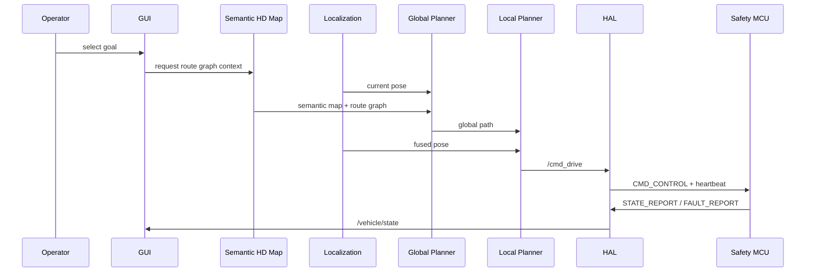

# ARIS Workflows

Source: `260617 - AI System Architecture Specification v1.0.pdf`

Controlling Korean final: `FINAL_ARCHITECTURE_SPEC.md`

This document defines development, runtime, validation, safety, and map-update workflows.

## 1. Milestone Loop

1. Read the controlling architecture documents.
2. Implement only the current milestone behavior.
3. Preserve `/cmd_drive`, `/vehicle/state`, TF, and safety contracts.
4. Run unit tests for pure logic.
5. Run ROS2 build and smoke tests through Nix/Just.
6. Record evidence.
7. Move to the next milestone only when completion criteria pass.

Milestone order:

```text
V0 manual control -> V1 trajectory replay -> V2 LiDAR localization -> V3 Semantic HD Map -> V4 goal-based navigation -> V5 dynamic obstacle avoidance -> V6 multimodal semantic update
```

## 2. Runtime Autonomy Sequence



## 3. Boot Workflow

1. Power on.
2. MCU self-test.
3. PC starts heartbeat.
4. Sensors become ready.
5. Fixed TF loads from URDF.
6. Localization initializes.
7. System enters standby.
8. Operator arms only after safety checks pass.

## 4. V0 Manual Control Workflow

1. Launch bringup in simulation-safe mode.
2. Send teleop input.
3. Confirm `/cmd_drive`.
4. Confirm `/vehicle/state`.
5. Confirm `/estop` stops motion.
6. Record rosbag if needed.

## 5. V1 Teach-and-Repeat Workflow

Teach:

1. Drive manually in sim or safe dry-run mode.
2. Subscribe to `/odometry/filtered`.
3. Save waypoints every configured distance, such as 0.2 m.
4. Store route CSV under `ARIS_DATA/routes`.
5. Include `x`, `y`, `yaw`, `v_target`.

Repeat:

1. Load selected route CSV.
2. Publish route visualization.
3. Track route with Pure Pursuit.
4. Publish `/cmd_drive`.
5. Stop near the final waypoint or on E-stop.

Acceptance: recorded route loads and vehicle follows through `/cmd_drive`; early sim target lateral error is about +/-0.3 m under matching conditions.

## 6. V2 LiDAR Localization Workflow

1. Predict motion using IMU and wheel odometry.
2. Correct pose with LiDAR scan matching.
3. Apply GPS as weak global anchor.
4. Use camera place recognition for ambiguous locations.
5. Publish `/odometry/filtered`.
6. Publish `map -> odom`.

Acceptance: localization owns `/odometry/filtered` and `map -> odom`; planner no longer depends on simulator ground truth.

## 7. V3 Semantic HD Map Workflow

1. Record LiDAR, camera, GPS, IMU, encoder, and pose data.
2. Build metric point cloud and voxel grid.
3. Derive occupancy cells.
4. Apply semantic tags from camera/perception and GUI review.
5. Compute traversability fields.
6. Generate route graph nodes and edges.
7. Save map artifacts with version metadata.
8. Inspect map in GUI.

## 8. V4 Goal-Based Navigation Workflow

1. Operator selects goal in GUI.
2. System resolves goal to map/route graph coordinates.
3. Global planner runs A* or Dijkstra.
4. Cost includes distance, risk, narrowness, curvature, and semantic penalty.
5. Planner publishes `/global_path`.
6. Local planner tracks path and publishes `/cmd_drive`.
7. GUI monitors pose, confidence, path, and faults.

## 9. V5 Dynamic Obstacle Avoidance Workflow

1. Compare current scan to static map.
2. Detect dynamic obstacles.
3. Classify object risk when possible.
4. Update local obstacle field.
5. Local planner slows, stops, or detours.
6. If blocked, report event to GUI.

Current simulation gate:

1. `dynamic_obstacle_node` reads `/scan_cloud`.
2. It filters points inside the forward driving corridor.
3. It publishes `/aris/perception/dynamic_obstacle` as a JSON advisory with `clear`, `slow`, or
   `stop`.
4. `local_planner_node` applies the advisory before publishing `/cmd_drive`.
5. `just v5-dynamic-obstacle-smoke` verifies that `slow` caps speed and `stop` commands full
   braking through the same `/cmd_drive` contract used by the simulator and HAL.

## 10. V6 Multimodal Semantic Update Workflow

1. Collect logs, images, map deltas, and change candidates.
2. Generate semantic annotation suggestions.
3. Explain events such as blocked road, crowding, or new obstacle.
4. Present suggestions to an operator or map review process.
5. Commit reviewed map changes with provenance.

Prohibited: AI publishing `/cmd_drive`, releasing E-stop, clearing safety faults, or enabling real actuation.

## 11. Safety Validation Workflow

Run before any hardware bench test:

1. Confirm real motors and brakes are disconnected.
2. Confirm `ARIS_ENABLE_REAL_ACTUATION` is not set.
3. Verify dry-run state on `/vehicle/state`.
4. Verify heartbeat timeout at 200 ms.
5. Verify timeout produces throttle 0 and brake apply.
6. Verify E-stop disables motor command and applies brake.
7. Verify invalid frame handling.
8. Record results before connecting actuation hardware.

Hardware progression:

```text
simulation -> dry-run bridge -> bench without motors -> bench with disabled motor -> low-power actuator test -> closed-site low-speed test
```

## 12. Map Update Review Workflow

1. Store observation with timestamp and pose.
2. Update observation count and free count.
3. Add semantic vote if classification exists.
4. Update confidence.
5. Compute change score.
6. Create change candidate if threshold is exceeded.
7. Review candidate in GUI.
8. Optionally request AI explanation.
9. Approve, reject, or defer.
10. Write map version metadata.

## 13. Failure Sequences

Heartbeat failure:

```text
heartbeat miss -> 200 ms timeout -> throttle 0 -> brake apply -> fault report -> operator clear
```

E-stop:

```text
button or CMD_ESTOP -> motor disable -> brake apply -> latch -> log -> manual recovery
```

Localization loss:

```text
confidence drop -> speed limit -> relocalization -> safe stop if recovery fails
```

Power loss:

```text
power loss detect -> UPS MCU survival -> brake command -> fault log -> state save
```
